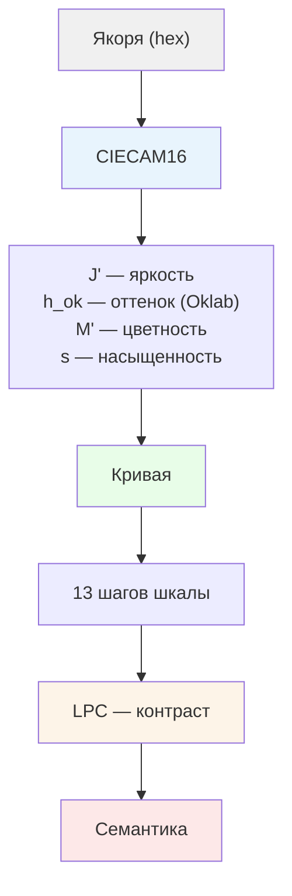
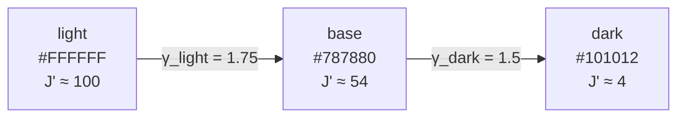
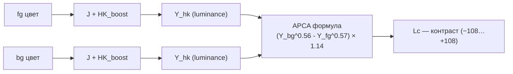
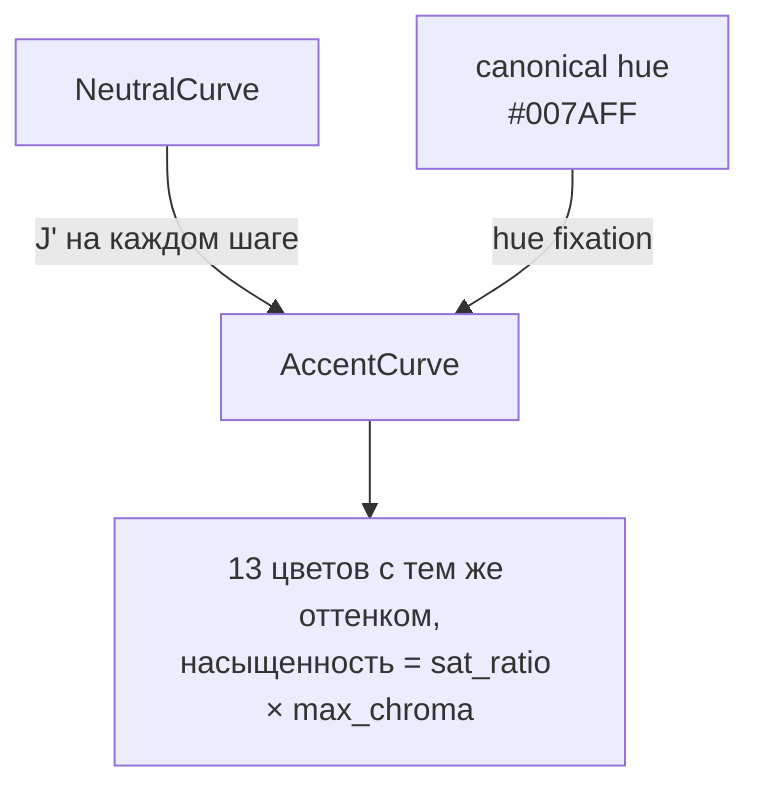

# Lab Colors

Генератор цветов для дизайн-систем. На входе — три якорных цвета, на выходе — перцептуально ровная шкала от светлого к тёмному.

Ядро написано на Rust, без внешних зависимостей. Математика основана на CIECAM16 и APCA.

## Проблема

Обычные шкалы (HSL lightness, Oklab L) не учитывают, как видит глаз:

- Серый `#808080` не выглядит «половиной» между чёрным и белым — он кажется светлее 50%
- Синий и жёлтый одинаковой яркости воспринимаются по-разному (эффект Гельмгольца-Кольрауша)
- В тёмной теме тот же цвет выглядит иначе (адаптация зрения к окружению)

Lab Colors решает это через три слоя модели.

## Три слоя



### 1. Цветовое пространство — CIECAM16

`sRGB → XYZ → CIECAM16 JCh` — модель цветового восприятия CIE. Учитывает:

| Параметр | Что моделирует |
|----------|---------------|
| `J'` | Воспринимаемая яркость (не линейная — через адаптацию) |
| `M'` | Цветность (насколько «цветной») |
| `h_cam` | Оттенок по CAM16 |
| `h_ok` | Оттенок по Oklab (для интерполяции) |
| `s` | Насыщенность = M' / (J' + 1) |

** ViewingConditions** — условия просмотра. Тот же стимул в светлой и тёмной среде даёт разные J':

```rust
// Светлая тема — стандартные условия sRGB
let avg_vc = ViewingConditions::srgb();        // c = 0.69

// Тёмная тема — приглушённое окружение
let dim_vc = ViewingConditions::dim_surround(); // c = 0.59

// #787880 в светлой теме: J' ≈ 53.5
// #787880 в тёмной теме: J' ≈ 59.2  ←mid-grey кажется светлее
```

### 2. Кривая — NeutralCurve

Три якоря (светлый, базовый, тёмный) соединяются кривой в пространстве J'.



**Степенная интерполяция** — J' не линейный, а через `u^γ`. Это даёт больше шагов в середине шкалы (где глаз различает лучше) и меньше на краях.

**Hue-purity кривая** — эффект Эбни: серые якоря имеют неопределённый оттенок (atan2 от шума). Вместо жёсткого порога используется плавная функция:

```
purity = (mp / mp_ref)^0.6
```

При `purity → 0` (серый): оттенок принудительно к базовому. При `purity → 1` (насыщенный): оттенок якоря остаётся как есть.

**Chroma envelope** — цветность проходит через синусоиду с пиком около t=0.35, что даёт лёгкий хроматический горб в средних тонах и спад к чёрному.

### 3. Контраст — LPC

LPC (Lab Pics Contrast) = APCA формула + коррекция Гельмгольца-Кольрауша.



**HK-boost** — насыщенные цвета воспринимаются ярче. Для синего на белом контраст поднимается, для серого — нет.

**APCA** — асимметричная формула: светлое на тёмном и тёмное на светлом считаются по-разному (разные экспоненты).

**LPC ≠ WCAG.** WCAG считает `|L1 - L2|`, что симметрично и не учитывает HK. LPC точнее: серый на белом ≈ Lc 89, синий на белом ≈ Lc 70 — хотя WCAG даст им одинаковый контраст.

## AccentCurve

Акцентный цвет (например `#007AFF`) протягивается через нейтральную шкалу:



На каждом шаге:
1. Берём J' из нейтральной шкалы
2. Переводим в Oklab L через бинарный поиск
3. Находим максимальную хроматику для этого L и hue
4. Умножаем на `sat_ratio` (насколько насыщен исходный цвет от максимума)
5. При необходимости сдвигаем hue для попадания в гамут sRGB

## API

```rust
use labcolors_core::{LcsColor, ViewingConditions, ColorCurve};
use labcolors_core::neutral::{NeutralCurve, CurveParams};
use labcolors_core::scale::AccentCurve;

// Нейтральная шкала — светлая тема
let light = NeutralCurve::new("#FFFFFF", "#787880", "#101012")?;
let steps: Vec<String> = light.sample_hex(13);
// ["#FFFFFF", "#F0F0F5", "#E1E1E9", ..., "#101012"]

// Нейтральная шкала — тёмная тема
let dim_vc = ViewingConditions::dim_surround();
let dark = NeutralCurve::with_vc(
    "#FFFFFF", "#787880", "#101012",
    &CurveParams::default(), &dim_vc
)?;

// Акцент
let blue = AccentCurve::new("#007AFF", &light)?;
let blue_steps: Vec<String> = blue.sample_hex(13);

// Контраст между двумя цветами
let lc = labcolors_core::lpc::lpc("#000000", "#ffffff");
// lc ≈ 108.7

// Generic trait
fn print_curve(curve: &dyn ColorCurve) {
    for i in 0..=12 {
        let c = curve.at(i as f64 / 12.0);
        println!("t={:.2}  J'={:.1}", i as f64 / 12.0, c.jp);
    }
}
```

## Структура проекта

```
crates/labcolors-core/src/
├── lib.rs           — реэкспорты
├── lcs.rs           — LcsColor: хранение и конвертация (hex ↔ CAM16)
├── neutral.rs       — NeutralCurve: нейтральная шкала
├── scale.rs         — AccentCurve: акцентная шкала
├── curve.rs         — ColorCurve trait
├── lpc.rs           — LPC контраст (APCA + HK)
├── sentiment.rs     — sentiment-цвета (brand displacement)
└── spaces/
    ├── cam16.rs     — CIECAM16 forward/inverse
    ├── cat16.rs     — CAT16 cone transform
    ├── oklab.rs     — Oklab hue
    ├── srgb.rs      — sRGB ↔ XYZ
    ├── vc.rs        — ViewingConditions (srgb, dim_surround)
    └── mod.rs
```

## Тесты

```
61 тест, 0_failures:
  lcs.rs      9  — roundtrip, dim VC, wrong-VC drift
  neutral.rs  14  — monotonicity, hue drift, bounds, dim ×5
  scale.rs    11  — accent monotonicity, gamut, dim ×3
  vc.rs        5  — surround params, aw ordering
  lpc.rs       6  — HK contrast, polarity, surface
  oklab.rs     6  — hue, roundtrip, gamut
  sentiment    8  — displacement, warning floor
```

## Что дальше

- **semantic.rs** — семантические токены (text-primary, border-base, bg-surface) через LPC контраст и visual weight
- **labcolors-preview** — визуализатор: HTML с реальными цветами, ползунками, side-by-side light/dark
- **Dark theme** — VC-параметризованные кривые готовы, нужна семантика с другими порогами
